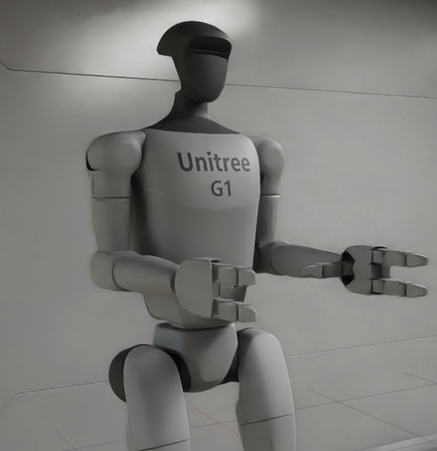
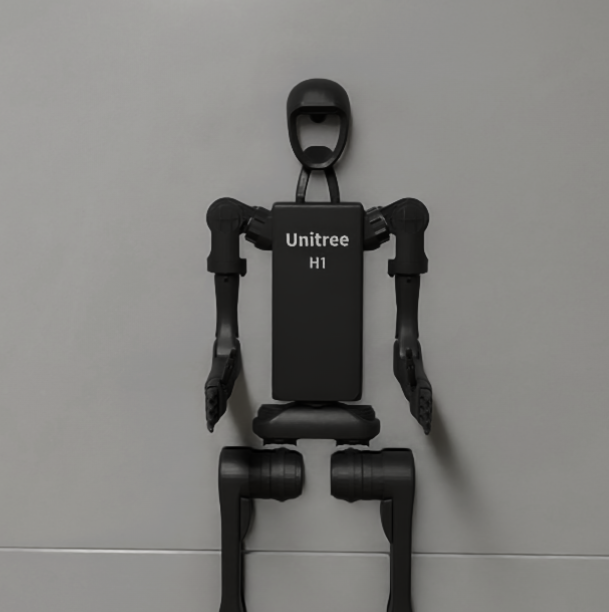
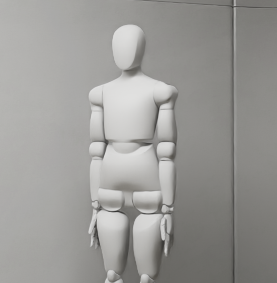

# Reinforcement Learning in Isaac Lab

You can find my forked repository on [GitHub](https://github.com/lajazz23/Unitree-G1-IsaacLab-Locomotion/tree/main).

This resource is used to document my edits to the original Isaac Lab repository for my project.

## Project overview

The Isaac Lab VR project is my project for the Summer 2025 SULI internship at Brookhaven National Lab. In this project, we build on top of the original Isaac Lab repository to create a trained Reinforcement Learning model using the [Unitree G1 robot](https://www.unitree.com/g1/) and [RL Games](https://github.com/Denys88/rl_games). We implement Virtual Reality as a method of evaluation and interaction with the robots in the simulation.

## Why Humanoid Robots?

Humanoid robots excel in human-centric environments. With little need for additional accommodations, humanoid robots exist as a practical tool for performing tasks that are unsafe, repetitive, or impractical for humans.​

### Unitree G1 Robot

The [Unitree G1](https://www.unitree.com/g1) robot was developed by Unitree Robotics, a Chinese company based in Hangzhou, China in 2024. Standing at 12.7 m tall, this humanoid robot is optimal for research and development due to its open-source SDK. Due to its compatibility with Isaac Lab, it is a great candidate for research in reinforcement learning with minimal transfer cost. Furthermore, the robot is compatible with virtual reality and teleoperation. In our project, the G1 robot has 37 joint motors, allowing for the performance of flexible tasks. 

### Unitree H1 Robot

The [Unitree H1](https://www.unitree.com/h1/) is a bigger and more powerful robot compared to the G1. It is able to perform similar tasks, and excels in stability while performing locomotion tasks. The SDK is open-source, in C++, Python, and ROS2, easily allowing it to be worked on in research. 

### Fourier GR-1

The [Fourier GR-1](https://www.fftai.com/products-gr1) was developed by Fourier as a humanoid robot standing at 16.5 m tall. With built-in emotional systems, it mimics humans and can hold a proper human-robot conversation. It uses the Fourier Smart Actuator to integrate all movements into a single module. The GR1 has been deployed into industry to perform service tasks. While teleoperation is possible, it is not fully supported.

### Neo

Neo Gamma is a humanoid robot designed for home use, developed by 1X, a tech company based in California. The robot is not bipedal, meaning that full-body locomotion cannot be tested. Neo uses embodied LLMs to learn its movements, making it easy to integrate AI agents. Furthermore, it is backed by OpenAI, allowing for longer-term support in its development.

### Poppy Humanoid

[Poppy](https://www.poppy-project.org/en/for-science/) is an open-source, 3D-printable humanoid robot created by the Flowers team at Inria. Poppy has been designed to be able to dance, walk, interact with humans, and perform.  it contains 25-DoF with an actuated vertebral column.

### Berkeley Humanoid Lite
The [Berkeley Humanoid Lite](https://arxiv.org/pdf/2504.17249) is a robot designed at UC Berkely that is designed to be accessible and customizable. With parts widely available, the robot can be easily produced in any lab. With modular self-contained actuators and CAN communication, the robot can be configured with flexible joints and limbs.

### HopeJr

[HopeJr](https://huggingface.co/docs/lerobot/hope_jr) is an open-source robot developed by HuggingFace after their acquisition of Pollen Robotics.  It contains 66 DoF, making it very versatile. With its integration into the LeRobot toolchain, it has access to data recording, teleoperation, and RL-based training.

## Author

Jasmin Lin

jlin3@bnl.gov